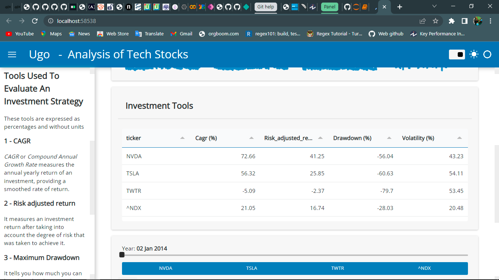

# Stock-Analysis
Created a responsive panel dashboard of twitter, nvidia, tesla and nasdaq100 stocks

# EDA and Panel Dashboard

This is a solution to the white belt analyst project. These challenges help you improve your coding and analysis skills by building realistic projects. 

## Table of contents

- [Overview](#overview)
  - [The challenge](#the-challenge)
  - [Notebooks](#notebooks)
  - [Excel files](#excel-files)
  - [Screenshot](#screenshot)
  - [Links](#links)
- [My process](#my-process)
  - [Built with](#built-with)
  - [What I learned](#what-i-learned)
  - [Continued development](#continued-development)
  - [Useful resources](#useful-resources)
- [Author](#author)
- [Acknowledgments](#acknowledgments)

## Overview

### The challenge

Create a dashboard using any tool of your choice to analyze tech stock (between nvidia, twitter, tesla)

### Notebooks
Two notebooks were created during the course of this project
- The [invest](./invest.ipynb) notebook which contains EDA using matplotlib, pandas.
- The [panel_stock_dashboard](./panel_stock_dashboard.ipynb) which contains the code used to build the dashboard using panel.

### Excel Files
- All of the data extracted from yahoo finance is contained in the [fin data sheet](./fin_data.xlsx), which can be used for further analysis.
- The [fin main sheet](./fin_main_sheet.xlsx) solely has the tickers' closing price and volume.

### Screenshot

 

### Links

- To view the static dashboard visit [dashboard](https://paneldashboard.netlify.app)

## My process

### Built with

Python using libraries such as:
- Panel
- Pandas
- Numpy
- Matplotlib etc.

### What I learned

Learning about the panel libarary made this project a whole lot easier. From the documentations to the ease of implementation, panel was wonderful.

### Continued development

Can't wait for when it becomes easier to source a panel .ipynb or .py file into pyscript making it interactie on the web

### Useful resources

- [Panel](https://panel.holoviz.org/index.html) - Panel documentation.
- [Thu Vu Panel/HvPlot Video](https://youtu.be/uhxiXOTKzfs) - This is an amazing video which helped me understand panel. I'd recommend it to anyone who wants to give panel a try.

## Author

- Twitter - [Ugochukwu](https://www.twitter.com/_EightKing)

## Acknowledgments

Thanks to the developers contributing to panel development. Thanks to Thu Vu for the wonderful video that got me interested in dashboarding with python. Shout out to the white belt analysts, Bolu, Homo, and Mubarak Adigun for pushing me.
